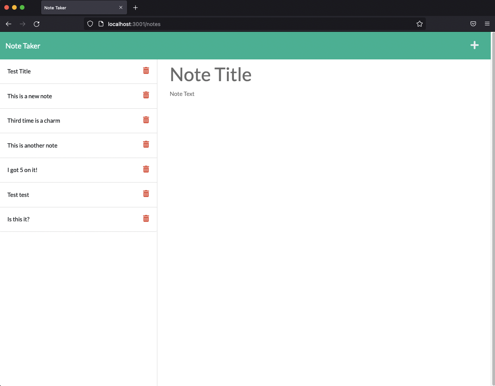

# Note Taker App

## Purpose

This is a web app that allows you to create and store notes.

## Built With

- JavaScript
- HTML
- CSS
- Bootstrap
- Node.js
- Express.js
- Heroku

## Usage

Repository
https://github.com/narcpat/note-taker-app

App link:

## Contribution

Made with ❤️ Patrick Narcisse (aka narcpat)

## Credits

I made use of our previous "Zoo Keepr" app for much of the logic in building this app.

The following YouTube video by Raddy was also useful for me deploying the app to Heroku:

- https://www.youtube.com/watch?v=r2S89Hm1Uq0&t=143s

## Special Thanks

A big thank you to my instructors Ali, Devon and Mija, who each helped me get unstuck at various stages.
